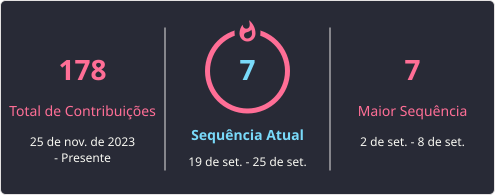

###

  
  
  
  
  
  
  

###

  

###

<picture>
  <source media="(prefers-color-scheme: dark)" srcset="https://raw.githubusercontent.com/Joaoxzx/Joaoxzx/output/pacman-contribution-graph-dark.svg">
  <source media="(prefers-color-scheme: light)" srcset="https://raw.githubusercontent.com/Joaoxzx/Joaoxzx/output/pacman-contribution-graph.svg">
  
</picture>

###

<h2 align="center">Contato</h2>

  
  

---

## Sobre mim

Olá! Eu sou o João Pedro, Software Developer apaixonado por tecnologia e por transformar ideias em soluções práticas. Minha jornada na área começou na Universidade de Franca (UNIFRAN), onde curso Análise e Desenvolvimento de Sistemas e venho construindo uma base sólida que me permite atuar tanto no frontend quanto no backend.

No dia a dia, trabalho principalmente com TypeScript, usando Next.js para criar interfaces dinâmicas no frontend e Node.js no backend. Também utilizo MySQL para bancos de dados e Docker para manter ambientes consistentes entre desenvolvimento e produção. Estou sempre buscando evoluir minhas habilidades, aprender novas tecnologias e criar soluções cada vez mais eficientes e bem estruturadas.

---
